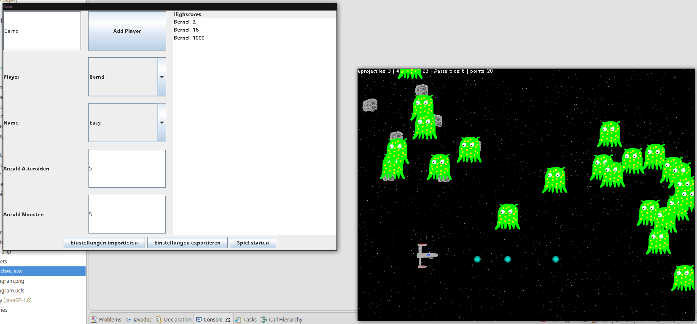

# Einführung

Ziel der folgenden Übungen ist ein kleines Spiel. Das Spiel ist ein kleines side-scroller bei dem der Spieler ein Raumschiff durch ein Asteroidenfeld steuert und nebenbei gegen Monster kämpfen muss.

## Aufgaben

1. Um dir einen Überblick über den bestehenden Code zu verschaffen, versuche im ersten Schritt ein **UML-Klassendiagramm** des Codes zu erstellen.

2. Fuelle die mit **TODO** markierten Teile des Codes. \newline
   Tip: Eclipse bietet unter `Window` -> `Show View` -> `Tasks` eine eigene View, die alle **TODO**s eines Projekts anzeigt.
   
   - Wenn du das Spiel startest, siehst du einen durchlaufenden Hintergrund und links oben in der Ecke ein kleines HUD. 
     Am HUD kannst du erkennen, dass bereits monster erstellt werden, du kannst sie allerdings nicht sehen.
     Dies liegt daran, dass die zu zeichnenden Elemente nicht in der Richtigen Reihenfolge gemalt werden.
     Navigiere in die Datei `exercises/one/game/engine/Renderable.java` und implementiere die `compareTo()`-Methode.
     Frage hierzu außerdem: Was fällt die an der `compareTo` auf und wofür steht das `default`?
     
     Wenn du alles richtig gemacht hast, solltest du nun ein Raumschiff und Monster sehen.
   
   - Allerdings kannst du noch nichts machen. 
     Du kannst das Raumschiff noch nicht bewegen.
     Um dies zu ändern gehe in die Datei `exercises/one/game/engine/Input.java`.
     Dort siehst du bereits, dass diese Klasse das Interface `KeyListener` implementiert.
     Um zu unterstützen, dass Keys auch gehalten werden können, musst du mit einem `boolean`-Array arbeiten, bei dem du jeweils die Keys auf `true` setzt die gedrückt wurden und wieder auf `false` zurück sobald die Keys wieder losgelassen werden.
     Da du später wieder wissen musst, welche Stelle im Array für welchen Button steht, wurde bereits ein `enum` angelegt, welcher für die jeweiligen Buttons steht.
     
     Wenn du je nach Button die richtigen Stellen im Array setzt, solltest du nun in der Lage sein, das Raumschiff zu bewegen.
     
   - Aber so ist das ganze Natürlich noch ein wenig langweilig und manche stellen kann man leider nicht schaffen... Es wäre doch cool, wenn man schießen könnte!
     Deine Aufgabe ist nun, dies zu implementieren. Füge dem `enum` für die Buttons noch ein Feld für einen weiteren Key hinzu (z.B. `space`) und setzte die Werte im Array.
     Gehe nun noch in die Datei `exercises/one/game/engine/GameLogic.java` und suche die Methode `update`.
     Implementiere nun, dass ein neues `Projectile` gespawned wird, wenn der Key gedrückt ist.
     
     Wenn du alles richtig gemacht hast, solltest du nun in der Lage sein, einen Schuss zu erstellen, der sich über den Bildschirm bewegt.
